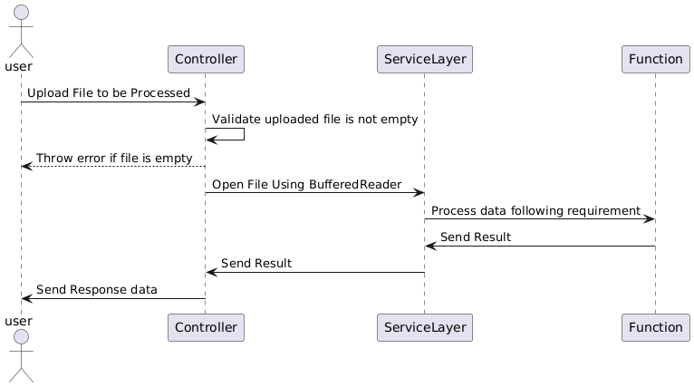

# CSG Words Project

This is a Spring Boot project that demonstrates a REST API that process a file according to the rules below :
- Counts and returns the NUMBER of words (i.e. Strings) that start with "M" or "m".
- Returns all the words longer than 5 characters.

## Table of Contents

- [Introduction](#introduction)
- [Features](#features)
- [Requirements](#requirements)
- [Swimlane Diagram](#swimlane-diagram)  
- [Installation](#installation)
- [Build the JAR File](#build-the-jar-file)
- [Running the Application](#running-the-application)
- [Accessing the API Documentation](#accessing-the-api-documentation)
- [Usage](#usage)

## Introduction

This project processes a text file to index words based on specific business rules. The current implementation counts words starting with "M" or "m", and lists words longer than 5 characters.


## Features

- Counts words starting with "M" or "m"
- Lists words longer than 5 characters
- Unit test using JUnit
- OpenAPI (Swagger) integration for API documentation


## Requirements

- Java 17 or higher
- Spring Boot 3.3.1 or higher


## Swimlane Diagram

Here is a swimlane diagram to illustrate the process:




## Installation

1. Clone the repository:
    ```sh
    git@github.com:markpanjaitan/csg_words.git
    ```

2. Build the project using Maven:
    ```sh
    mvn clean install
    ```

## Build the JAR File

To build the JAR file for the application, run the following Maven command:

```sh
mvn package
```
This will create a JAR file in the target directory of your project. The JAR file will be named something like csg_words-0.0.1-SNAPSHOT.jar


## Running the Application

To run the application using the generated JAR file, use the following command:

```sh
java -jar target/csg_words-0.0.1-SNAPSHOT.jar
```

The application will start on `http://localhost:8080`.


## Accessing the API Documentation

Once the application is running, you can access the Swagger UI for API documentation at:
[http://localhost:8080/swagger-ui.html](http://localhost:8181/swagger-ui/index.html)


## Usage

Here is an example of how to use the API endpoint:

1. Open your browser and navigate to `http://localhost:8080/swagger-ui.html`.
2. Find the API endpoint (/api/words-counter).
3. Click on the endpoint to expand it and see the details.
4. Use the provided UI to choose/upload a TXT file, and view the response.
5. An example file (docs/text_example.txt) is provided for testing purposes.

